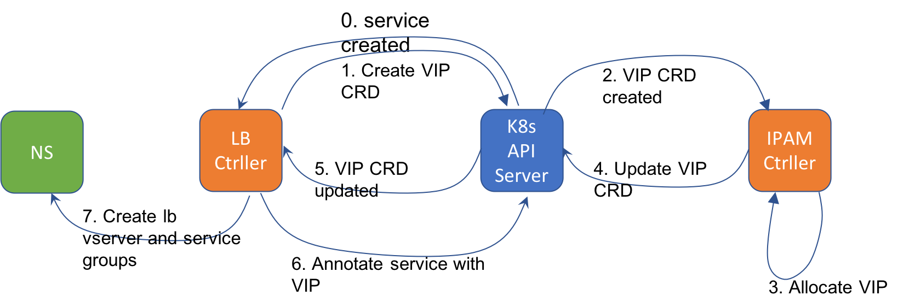

# Kubernetes Service LoadBalancer with IPAM and NetScaler
Solution to support Kubernetes service `Type=LoadBalancer` on Baremetal with NetScaler. Solution includes VIP IP address management

# Theory of Operation
1. The `LoadBalancer` Type is supposed to be specific to a Cloud Provider (e.g.,GCE, AWS, OpenStack). There is no provider for Baremetal Kubernetes
2. When a cloud provider is present, the cloud provider allocates a VIP (or DNS name in AWS) and fills in the value for the `Service.Status.LoadBalancer.Ingress`
3. For Baremetal, we write two custom controllers - a LoadBalancer Controller and an IPAM controller.
4. The IPAM controller uses a Custom Resource (CRD) called `vip` and writes the allocated VIP to this CRD.
5. The LoadBalancer controller watches the `vip` CRD and updates a service annotation with the VIP. 
6. The LoadBalancer controller can also configure a NetScaler (TODO) with the VIP, the `lb vserver` and `service group` based on the service definition from Kubernetes



# Building
You can build the Docker files and push them to a local repository (change the repository name from `localhost:5000` in the `Makefile` and `deploy/deploy.yml`)

   ```
   make docker
   
   ```

# Deploying
Deploying involves deploying the `vip` CRD, the RBAC for the controllers and then the controller themselves
You can customize the VIP range(s) used by the IPAM controller with the list env variable `VIP_RANGE` in `deploy/deploy.yml`

  ```
  make deploy
  ```

# Try it out
  ```
   kubectl run echo1 --image=k8s.gcr.io/echoserver:1.4 --port=8080
   kubectl expose deployment echo1 --type=LoadBalancer
  ```
  You should see an annotation appear for the service `echo1` called `com.citrix.vip` with a particular IP drawn from `VIP_RANGE`
